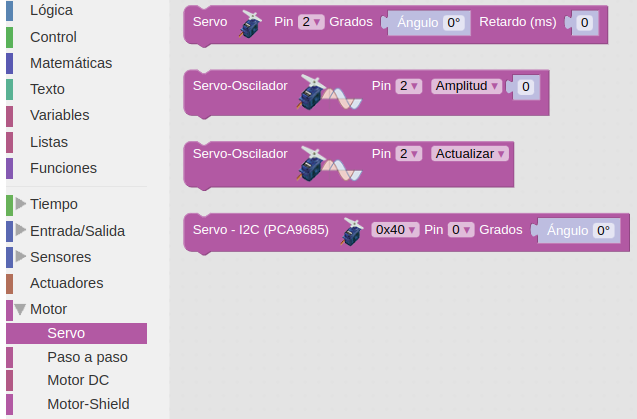
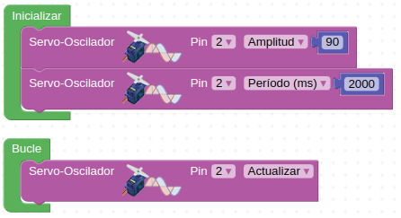
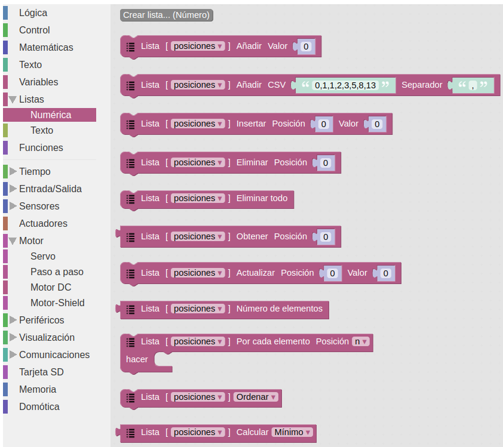
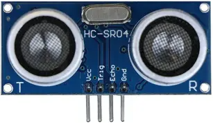
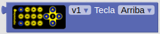

## **Ideas básicas de sonido**
Antes de entrar en descripciones técnicas de componentes vamos a hablar un poco del sonido, sin entrar en profundidad, y como reproducirlo con un dispositivo que incorpore un zumbador pasivo.

El buzzer, zumbador o altavoz es un transductor electroacústico (convierte una señal eléctrica en una onda de sonido) que produce un determinado zumbido o sonido. Existen de dos tipos:

* Pasivos: no disponen de electrónica interna, por lo que tenemos que proporcionar una señal eléctrica para conseguir el sonido deseado.
* Activos: disponen de un oscilador interno, por lo que únicamente tenemos que alimentar el dispositivo para que se produzca el sonido.

Uno de los parámetros que caracterizan a un sonido es su frecuencia de emisión, siendo la frecuencia el número de veces que se repite por unidad de tiempo (segundo). La transmisión del sonido se realiza por ondas a través en cualquier medio (sólido, líquido o gaseoso) excepto en el vacío. La frecuencia de un sonido nos indica cuantos ciclos por segundo tiene una onda.

En la imagen y la tabla siguientes vemos un dibujo con un fragmento de las teclas de un piano estando todo referido a una nota estándar, la nota "La" central que tiene una frecuencia de 440 Hz. Podemos ver la nota musical que reproduce, en las dos notaciones más comunes de los sonidos (Inglés: C D E F G A B, Alemán: C D E F G A H, Español, italiano y francés: Do Re Mi Fa Sol La Si) y además se encuentra la frecuencia que produce esa nota musical.

  

Otro de los parámetros que caracterizan al sonido es su nivel y en sonido se caracteriza con los decibelios (dB) que es la forma de medir la intensidad del sonido. La percepción del sonido depende de factores como la intensidad, el tiempo que dura, las frecuencias o tonos y el entorno donde estamos. Vamos a introducir brevemente como medir la intensidad del sonido.

Los decibelios (dB) son la unidad de medida de presión acústica. Medimos presión, luego estamos midiendo una fuerza y mas concretamente una fuerza por unidad de superficie. Un sonido pierde intensidad según nos alejamos de la fuente y lo hace a un ritmo de unos 6 dB cada que vez que se duplica la distancia. Vemos un ejemplo: supongamos que escuchamos un sonido de 45 dB a una distancia de un metro, cuando nos pongamos a dos metros escucharemos 39 dB, cuando estemos a 4 metros, será de 33 dB y cuando estemos a 8 metros, de 27 dB.

La escala de medida en dB no es lineal, es logaritmica porque representa mejor la forma en que sentimos los cambios de la intensidad del sonido con nuestro oido. Algunos datos para reflexionar sobre el ruido:

* El sonido se vuelve dañino para el ser humano a partir de los 75 dB.
* Alrededor de los 120 dB causa dolor. Una exposición de dos horas a 100 dB necesita un día completo para que el oido compense la exposición.
* Sonido en torno a 180 dB pueden ocasionar la muerte.

En la tabla vemos algunos ejemplos del día a día:

|nivel de sonido|Percepción|Situación|
|---|---|---|
|0 dB|Muy bajo|Nivel de audición humano|
|10 a 30 dB|Nivel bajo|Conversación tranquila. Biblioteca|
|30 a 50 dB|Nivel bajo|Conversación normal. Motor frigorifico. Agua saliendo del grifo|
|55 a 75 dB|Nivel considerable|Aspirador. Calle con trafico denso. Despertador. Batidora|
|75 a 100 dB|Nivel alto|Sensación molesta. Atasco de tráfico. Sirena de policia|
|100 a 120 dB|Muy alto|Taladro/claxon/concierto R&R = 120 dB. Interior discoteca = 110 dB|
|mas de 120 dB|Dolor|Avión despegando a 25 metros. Petardo a un metro|

Una equivalencia que nos puede ayudar a familiarizarnos con esta unidad es la tabla de equivalencias entre potencias y dBm (decibelios milivatio):

| P (mW) | dBm | P (mW) | dBm | P (mW) | dBm | P (mW) | dBm |
|:-:|:-:|:-:|:-:|:-:|:-:|:-:|:-:|
| 1 | 0 | 16 | 12 | 250 | 24 | 4 W | 36 |
| 1.3 | 1 | 20 | 13 | 315 | 25 | 5 W | 37 |
| 1.6 | 2 | 25 | 14 | 400 | 26 | 6 W | 38 |
| 2 | 3 | 32 | 15 | 500 | 27 | 8 W | 39 |
| 2.5 | 4 | 40 | 16 | 630 | 28 | 10 W | 40 |
| 3.2 | 5 | 50 | 17 | 800 | 29 | 13 W | 41 |
| 4 | 6 | 64 | 18 |  1 W | 30 | 16 W | 42 |
| 5 | 7 | 80 | 19 | 1.3 W | 31 | 20 W | 43 |
| 6 | 8 | 100 | 20 | 1.6 W | 32 | 25 W | 44 |
| 8 | 9 | 125 | 21 | 2 W | 33 | 32 W | 45 |
| 10 | 10 | 158 | 22 | 2.5 W | 34 | 40 W | 46 |
| 13 | 11 | 200 | 23 | 3 W | 35 | 50 W | 47 |

Si observamos cuidadosamente la tabla veremos que la potencia se duplica o divide por dos, según recorramos la tabla, cada 3 dB.

### **Zumbador pasivo**
Un zumbador o buzzer pasivo no es mas que un pequeño altavoz que nos sirve para convertir una señal eléctrica en una onda de sonido. Son dispositivos que no disponen de ningún tipo de electrónica interna, por lo que tenemos que proporcionar una señal eléctrica para conseguir el sonido deseado.

Normalmente (como componente) estos dispositivos se incluyen en un módulo que incorpora un transistor y una resistencia de polarización del mismo para hacer funcionar al altavoz que actúa como carga.

Un buzzer se basa en un transductor piezoeléctrico que es capaz de variar su volumen con el paso de la corriente eléctrica, fenómeno que se aprovecha para hacer vibrar la membrana del altavoz. Esquemáticamente vemos esto en la figura siguiente:

  

Un zumbador pasivo requiere para su funcionamiento una señal de tipo PWM para poder indicarle la frecuencia y la duración de la señal.

El aspecto de un buzzer clásico visto por ambos lados nos ayudará a distinguirlo del activo.

  

### **Zumbador activo**
Este tipo de zumbador incluye un oscilador que genera una frecuencia audible fija y que se conoce como zumbador pasivo y,  en realidad, es el que de forma correcta **se puede denominar como zumbador**. Este es mucho mas sencillo de usar ya que basta con conectarlo a un pin digital y cuando pongamos a nivel alto este pin el zumbador generará su zumbido característico durante el tiempo que establezcamos. Con este tipo de zumbador no se pueden generar melodías.

Cuando está nuevo se distingue del zumbador pasivo o altavoz por la pegatina de protección que lo acompaña, pero esta hay que quitarla para oir el zumbido y sin ella es difícil distinguir un tipo del otro, salvo por su reverso. Es aconsejable marcar alguno de los dos cuando podemos distinguirlos, sobre todo si van a ir montados sobre una PCB. Una buena idea puede ser utilizar la propia pegatina en el lateral del mismo para distinguirlo a primera vista.

Un zumbador activo produce un tono audible fijo con tan solo aplicarle tensión.

El aspecto por ambos lados de uno típico nos ayudará a distinguirlo del pasivo.

  

## **Las comunicaciones I2C**

Las siglas I2C provienen del inglés Inter-Integrated Circuit (Circuito inter-integrado) y vamos a explicar un poco en que consiste este sistema de conexionado.

Bus conocido por las siglas I2C, IIC o I²C, es un bus serie de datos desarrollado en 1982 por Philips Semiconductors (hoy NXP Semiconductors, parte de Qualcomm). Se utiliza principalmente internamente para la comunicación entre diferentes partes de un circuito, por ejemplo, entre un controlador y circuitos periféricos integrados. Posteriormente fue adoptado progresivamente por otros fabricantes hasta convertirse en un estándar del mercado con miles de circuitos integrados de diferentes fabricantes.

I2C también se denomina TWI (Two Wired Interface) únicamente por motivos de licencia, denominación introducida por Atmel. No obstante, la patente caducó en 2006, por lo que actualmente no hay restricción sobre el uso del término I2C.

El bus I2C requiere únicamente dos cables o lineas de señal para su funcionamiento, uno para la señal de reloj (SCL, Serial Clock) y otro para el envío de datos (SDA, Serial Data). Ambas líneas precisan resistencias de pull-up hacia Vcc. Cualquier dispositivo conectado a estas líneas es de drenador o colector abierto (Open Collector), lo cual en combinación con las resistencias pull-up, crea un circuito Wired-AND. En la imagen siguiente vemos el diagrama básico de conexionado del bus con algunos ejemplos de dispositivos. La señal de reloj siempre es generada por el circuito que actúa como Master.

Para ser reconocido en el bus, cada dispositivo dispone de una dirección, que se emplea para acceder a cada uno de ellos de forma individual. Esta dirección puede ser fijada por hardware, en cuyo caso se pueden modificar los últimos 3 bits mediante “jumpers” o microinterruptores (ejemplo de la matriz de 8x8), o por software.

En general, cada dispositivo conectado al bus debe tener una dirección única. Si tenemos varios dispositivos similares tendremos que cambiar la dirección o, en caso de no ser posible, implementar un bus secundario.

El bus I2C tiene una arquitectura de tipo master-slave, lo que indica que el master es el encargado de controlar al resto de dispositivos tipo slave con los que se comunica y que se comunican con el, teniendo siempre el marte prioridad absoluta. El dispositivo master es el que inicia la comunicación con los slaves. Los slaves no pueden iniciar la comunicación (el master tiene que preguntarles), ni hablar entre si directamente.

El bus I2C debe ser por lo tanto síncrono, es decir debe existir una señal de reloj que controle las comunicaciones. Es el master el que proporciona la señal de reloj, que mantiene sincronizados a todos los dispositivos del bus. De esta forma, se elimina la necesidad de que cada dispositivo tenga su propio reloj, de tener que acordar una velocidad de transmisión y mecanismos para mantener la transmisión sincronizada como en UART o SPI. En la imagen vemos un cronograma ejemplo del funcionamiento del sistema.

El protocolo de comunicación I2C sigue la siguiente secuencia:

* Primero, el master genera la señal de reloj del bus (SCL).
* Se inicia la comunicación por orden del master al establecer la condición de START, que se produce cuando SDA pasa de uno a cero y se mantiene en cero durante un tiempo.
* El master direcciona a los slaves.
* El master indica si se va a leer o escribir.
* El slave direccionado responde con una señal de conformidad ACK (acknowledge).
* Se transmite los datos byte a byte desde SDA al receptor. Por cada pulso desde SCL se transmite un bit de información.
* El destinatario de la información responde con una señal de conformidad ACK.
* Se acaba la comunicación cuando el master establece la condición de STOP, que se produce cuando SDA, por orden del master pasa de cero a uno y se mantiene en uno durante un tiempo.

Son muchos los dispositivos I2C que se pueden direccionar por este bus I2C, siendo lo más común en los dispositivos para I2C que utilicen direcciones de 7 bits, aunque existen dispositivos de 10 bits, pero es un caso raro. Una dirección de 7 bits implica que se pueden poner hasta 128 (27) dispositivos sobre un bus I2C. Hemos visto que las direcciones son de 8 bits y esto es porque el bit extra de los 7 de la dirección lo emplea el master para informar al slave si va a leer o escribir. Si el bit de lectura/escritura es cero, el dispositivo master está escribiendo en el slave. Si el bit es 1 el master está leyendo desde el slave. La dirección de 7 bit se coloca en los 7 bits más significativos del byte y el bit de lectura/escritura es el bit menos significativo.

## **Pantalla OLED**

OLED es la abreviatura de (Organic Light-Emitting Diode) o diodo emisor de luz orgánico. Se dice orgánico debido a una película de carbono que se encuentra en el interior del panel, detrás del cristal protector. Cuando se colocan varias películas orgánicas entre dos conductores se puede hacer que cada pixel se ilumine de forma individual, haciendo muy eficiente este tipo de pantallas. Es decir, una pantalla OLED emite luz brillante propia al pasar corriente eléctrica.

Para su funcionamiento van ensambladas junto a un controlador CMOS SSD1306 y la electrónica necesaria para hacerla funcionar. Este controlador se encarga de obtener los datos y enviarlos a la OLED.

En la web se pueden encontrar muchas referencias que describen como trabaja. Aquí daremos una breve descripción de lo que nos interesa.

La coordenada X=0, Y=0 se corresponde con el extremos superior izquierdo y los ejes se sitúan de la siguiente forma:

Desde el origen de coordenadas, cada unidad que añadimos se corresponde con un desplazamiento de un pixel de la pantalla OLED.

En STEAMakersBlocks el bloque principal de escritura en pantalla tien la forma y las partes que podemos ver en la imagen siguiente:

El espacio de escritura del texto puede servir para ver los datos que devuelve algún sensor, para lo que se puede situar el bloque en el espacio destinado al texto (en la imagen siguiente se utiliza un bloque para ver los datos recogidos por un sensor de temperatura LM35):

  

También vamos a ver las herramientas disponibles en STEAMakersBlocks para el trabajo con gráficos. Para poder mostrar gráficos debemos generar un mapa de bits que indique que pixeles estarán apagados y cuales encendidos. STEAMakersBlocks dispone de una herramienta visual (OLED - Bitmap Data) que nos permite generar el código de los bitmaps y de un bloque que nos permite mostrarlos. El bloque para mostrar un bitmap es el de la imagen siguiente:

  

A la herramienta OLED - Bitmap Data podemos acceder por cualquiera de los métodos que vemos en la imagen siguiente:

En la imagen siguiente vemos la pantalla OLED - Bitmap Data y la explicación de sus partes.

La copia de datos se realiza en el apartado correspondiente (el cuadro de entrada de la derecha) del bloque mostrar un bitmap.

Puedes marcar directamente los píxeles que desees sobre el dibujo de la pantalla y estos serán los que se activarán en la pantalla OLED conectada a la placa.

O bien, puedes subir una imagen desde “Elegir archivos” (preferentemente ajustado a las dimensiones 128×64 px, aunque cualquier imagen que subas se adaptará a esta proporción):

La imagen siguiente resume todo el proceso que se puede seguir desde cargar la imagen hasta completar el bloque:

## **Pantalla LCD 1602 I2C**

Una pantalla LCD (del ingés, Liquid Cristal Display) de 2 líneas de 16 caracteres tiene el aspecto y la distribución de pines que vemos en la imagen siguiente.

Es evidente que deberíamos utilizar bastantes patillas de nuestra placa UNO para su control. En la imagen siguiente se muestra el conexionado mínimo necesario en una pantalla de este tipo: 4 bits para datos y dos señales de control En (Enable) y Rs (Register select). La conexión RW la ponemos a GND. Además se debe añadir una resistencia ajustable o un potenciómetro para regular el contraste de la pantalla.

Es preferible utilizar las que tienen el aspecto que vemos en la imagen siguiente:

En realidad el conjunto que vemos en la imagen anterior no es mas que una LCD 2x16 a la que se ha incorporado un módulo adaptador de LCD a I2C. Este modulo está especialmente diseñado para poder soldarlo directamente a la LCD y convertirla así en un dispositivo I2C que además ya lleva incorporado el potenciometro de ajuste de contraste.

Esta pantalla requiere cuatro cables para establecer las conexiones, dos cables SDA (datos) y SCL (reloj) para el bus de comunicaciones I2C y los dos cables de alimentación VCC y GND.

La dirección I2C por defecto de este tipo de módulos puede ser 0x3F o en otros casos 0x27, e incluso hay modelos en los que se puede cambiar. Para un correcto control es muy importante identificar correctamente la dirección I2C de nuestro modulo, que en el caso de la que incorpora el kit TdR STEAM es la 0x27, pues de otra forma nuestro programa no funcionará correctamente.

Una LCD 1602 I2C es muy sencilla de controlar a partir de los bloques que nos proporciona STEAMakersBlocks. En la imagen siguiente ponemos como ejemplo los bloques para imprimir un texto o variable en un par fila-columna determinado.

  

Seguidamente se muestra el sistema de distribución de filas y columnas.

### Escanear dispositivos I2C

Si no conocemos la dirección especifica de nuestro módulo podemos utilizar un pequeño programa que llamaremos Escaner-I2C y que se encargará de identificar la dirección I2C y todos los dispositivos I2C conectados a nuestra placa. Debemos crear un proyecto, en esta ocasión, de tipo "Arduino UNO" para tener disponible el menú I2C que nos de acceso al bloque "Escanear dispositivos I2C..." tal y como vemos en la imagen siguiente:

Un sencillo programa como el de la imagen siguiente nos permite ver los dispositivos I2C conectados y su dirección física asociada. El programa está disponible como [Escaner-I2C](http://www.STEAMakersBlocks.com/web/project/637339).

Si conectamos la consola el resultado de tener la placa TdR STEAM es el de la imagen siguiente:

### Cambiar la dirección física del dispositivo I2C

Esta tarea nos va a resultar especialmente útil si disponemos de LCDs I2C con una dirección fijada de fábrica y queremos conectar varias de ellas en nuestro proyecto. La parte posterior de la LCD 1602 de Keyestudio tiene el aspecto de la imagen siguiente. Nos fijaremos especialmente en los tres grupos de agujeros enmarcados en rojo. Aunque en este caso no vienen nombrados los vamos a denominar A0, A1 y A2 de izquierda a derecha.

La dirección por defecto de fábrica en este caso es la 0x27, pero se puede cambiar alterando la situación de conexionado de estos agujeros entre si según la tabla siguiente:

| A2 | A1 | A0 | Dirección |
|:|:|:|:|
| 0 | 0 | 0 | 0x27 |
| 0 | 0 | 1 | 0x26 |
| 0 | 1 | 0 | 0x25 |
| 0 | 1 | 1 | 0x24 |
| 1 | 0 | 0 | 0x23 |
| 1 | 0 | 1 | 0x22 |
| 1 | 1 | 0 | 0x21 |
| 1 | 1 | 1 | 0x20 |

Para establecer los unos de la tabla anterior basta con cortocircuitar los dos pads correspondientes. En la imagen siguiente se ha establecido la dirección física como 0x26.

### Definición de símbolos en la LCD

Dentro de los bloques del menú Visualización -> Pantalla LCD está el de "definir símbolo", que permite definir uno de los 8 símbolos personalizables que puede almacenar la pantalla LCD. El símbolo se define por un mapa de bits (unos y ceros indicando cada píxel del símbolo). Los símbolos tienen una resolución de 5x8 píxeles (blanco o negro).

En STEAMakersBlocks disponemos de una herramienta que nos ayuda a definir nuestros propios símbolos y podemos acceder a ella desde herramientas o haciendo clic derecho sobre el bloque, desplegándose en cualquier caso un editor muy sencillo de usar y que vemos con un ejemplo en la imagen en la siguiente:

Para tener el símbolo disponible simplemente copiamos la cadena generada en el lugar correspondiente del bloque.

## **Matriz 8x8 LEDs**

Una distribución de 8x8 LEDs en forma de matriz permite crear una pantalla pequeña que tiene 64 LEDs con el aspecto de la Figura siguiente y que se conecta al puerto de comunicación I2C.

Este mismo componente visto por su cara posterior:

Este tipo de matrices son 'multiplexadas', por lo que para controlar 64 LED necesitas 16 pines y eso son muchos pines aunque hay chips de controladores como el MAX7219 que pueden controlar una matriz, pero aún así hay mucho cableado que configurar y ocupan muchos pines. Para solucionar esto se utiliza un chip de control que tiene un reloj incorporado para multiplexar la pantalla. Además del módulo utiliza una fuente de corriente constante que permite obtener un color uniforme y brillante de todos los diodos. El conjunto forma una matriz de 8x8 que se controla a través de una interfaz I2C.

Sus principales características son:

* Matriz de LEDs de 8 filas y 8 columnas
* Direccionada por un chip HT16K33
* Conexión tipo I2C
* Tensión de alimentación: 5V
* Frecuencia de trabajo: 400KHz
* Potencia de entrada: 2.5W
* Corriente de entrada: 500mA

También existen matrices en las que está disponible un método de cambio de la dirección física del dispositivo mediante micro interruptores, como la que vemos en la imagen siguiente:

Estos dispositivos disponen de su propio menú de bloques y de un diseñador de mapas de bits similar al visto para los símbolos de la LCD que podemos apreciar en la figura siguiente:

## **Control de un servomotor**

### **El servomotor**

Un servomotor o abreviado servo es un motor especial que puede posicionar su eje en un ángulo determinado y lo puede mantener en esta posición. Los servos estándar suelen girar 180º, pero es habitual encontrar servos que giran 90º y otros 360º, que son los conocidos como servos de rotación continua. En el interior del mismo están ubicados tanto la electrónica de control como los engranajes reductores que a su vez pueden llevar o no topes físicos que marquen el ángulo de giro. Para su funcionamiento sólo necesitan ser alimentados (conexiones GND y VCC o 5V) y una señal de control.

Los servomotores son en realidad motores de corriente continua a los que se les ha añadido una reductora, para que giren más despacio y con más fuerza, y un controlador electrónico que permite hacer que gire un determinado ángulo. Además, el servo en todo momento sabe en qué posición está, aunque se apague o reinicie. Esto significa que si a un servo que hemos movido a un determinado punto, lo hemos dejado sin alimentación y al alimentarlo de nuevo le indicamos que gire 90º, no va a girar 90º sino que se va a dirigir a su posición de 90º que tiene memorizada internamente.

En la figura siguiente vemos el interior de un servo esquematizado.

Su aspecto real lo vemos en esta otra figura, donde también se aprecian los accesorios y tornillería que lo acompañan.

Veamos su principio básico de funcionamiento: La electrónica de control del servomotor tiene un circuito de referencia incorporado que emite la señal de referencia, que es un ciclo de 20 ms con un ancho de pulso de 1,5 ms. Se compara la tensión de control recibida con la de referencia y se genera una diferencia de tensión. El circuito de control en la placa decidirá la dirección de rotación en consecuencia y accionará el motor. El sistema de engranajes o reductora convierten el giro del motor en un par de fuerza a través del eje. El sensor detecta que se ha alcanzado la posición enviada de acuerdo con la señal de retroalimentación. Cuando la diferencia de tensión existe el motor gira y cuando la diferencia se reduce a cero, el motor se detiene. Normalmente, el ángulo de rotación es de 0 a 180 grados.

El servomotor viene con un conector hembra de tres pines para tres cables de conexión, que se distinguen por los colores marrón, rojo y naranja (diferentes marcas pueden tener diferentes colores).

El ángulo de rotación del servomotor se controla regulando el ciclo de trabajo de la señal PWM cuyo estándar es de 20 ms (50 Hz).

Hay que tener mucho cuidado de posicionar el conector de los servos en los tres pines macho de la shield en el orden correcto (el conector es reversible) o seguramente romperemos algo de manera irremediable.

Existe un tipo especial de servomotor que permite la rotación continua. En algunos casos se trata de servomotores “trucados” de forma que se modifican para permitir la rotación continua quitando los topes mecánicos y se sustituye el potenciómetro por un divisor de tensión con dos resistencia iguales (en algunos casos no se ponen resistencias y se bloquea el potenciómetro para que no gire dejándolo justo en su punto central). Este tipo de modificación la podemos realizar nosotros (en la web existen multitud de tutoriales) o también podemos comprar un servomotor de rotación continua listo para funcionar sin tener que hacer ningún tipo de bricolaje.

En el apartado de bloques de programación, se encuentra en "Motor / Servo" y en la figura siguiente vemos los bloques disponibles.

Para controlar el servomotor, indicamos los grados de rotación (Ángulo de giro) que queremos y el tiempo de retardo, o tiempo que tarda en ir de una posición a otra.

El control de un servomotor de rotación continua se realiza de igual manera, pero su reacción es diferente.

Los bloques Servo-Oscilador nos permiten de una forma sencilla hacer que el servo repita una secuencia de movimientos u oscilaciones de forma indefinida. Un ejemplo típico puede ser el que vemos en la figura siguiente, donde el servo oscila entre 0 y 90º en periodos de dos segundos.

El bloque Servo-I2C (PCA9685) es simplemente un bloque para manejar la tarjeta controladora para 16 servos PCA9685 utilizando el bus I2C.

### Tipos de servomotores

La clasificación básica la podemos establecer en los siguientes 4 tipos:

* Servomotores de corriente continua, que son los más habituales. Funcionan mediante un motor de corriente continua controlado por PWM. Dentro de estos existen multitud de ellos diferenciados por su torque y por su máximo ángulo de giro. Para nuestros proyectos los más usuales son los que vemos en la imagen siguiente:

Vemos en la imagen los tres tipos comerciales de Keyestudio para servos tipo 9g.

* Servomotores de corriente alterna, que se utilizan para controlar grandes fuerzas.
* Servomotores de imanes permanentes o Brushless. Construidos a base de motores de corriente alterna sin escobillas. Se utilizan para grandes torques y altas velocidades. Su uso principal está en la industria.

### Posición de inicio del servo

Antes de fijar con su tornillo cualquiera de las palas debemos averiguar cual es la posición de 0º o inicial del servo. Para ello vamos a crear el programa "KS_UNO_Posicionar_servo" que vemos en la figura siguiente o que podemos importar del enlace.

Ejecutamos el programa que hemos cargado en la placa, y lo tenemos que parar en el momento que el servo vuelve a la posición inicial (hace un giro repentino de 180º tras un tiempo de espera). En ese momento, quitamos el soporte tipo aspa vigilando de que no se modifique la posición del servo. Sin que el servomotor se haya movido, montamos el soporte en su lugar y damos por concluida la tarea.

### Listas

Las listas son un gran recurso del que podemos aprender mucho a través de los dos videos siguientes obra del autor de STEAMakersBlocks:

* [Listas numéricas dinámicas](https://www.youtube.com/watch?v=81g5EdbNhlA)
* [Listas de texto dinámicas](https://www.youtube.com/watch?v=5S-fcGT9zlU)

Las listas de datos nos permiten almacenar un listado de valores y acceder a ellos por su posición o índice en la lista. Las listas pueden ser de tipo numéricas o de texto, como vemos en la imagen siguiente:

Ahora la inicialización de las listas es dinámica y cuando creamos, por ejemplo, una de tipo numérico podemos ver todos los bloques disponibles para esa lista:

Si retomamos el ejemplo de posicionamiento del servo, podemos definir las posiciones repitiendo tantas veces como necesitemos el primero de los bloques o dando la lista de valores con el segundo en formato CSV, e incluso mezclar ambos bloques para definir dichas posiciones.

Vamos a implementar dicho programa mediante listas.

* Caso 1: repitiendo posiciones. El programa para este caso sería el siguiente:

* Caso 2: Definiendo una lista de valores. El programa para este caso sería el siguiente:

## **El sensor de ultrasonidos HC-SR04**

Los sensores ultrasónicos utilizan un sonar para determinar la distancia desde el sensor al objeto. Este módulo utiliza un chip CS100A que puede medir distancias entre 4 cm y 300 cm siendo la medida precisa y estable. El módulo incluye el transmisor y el receptor ultrasónicos y su circuito de control. El dispositivo debe conectarse a dos pines, lo que se debe a que para su funcionamiento necesita uno para emitir el ultrasonido (Trigger) y otro para recibirlo (Echo). El principio de funcionamiento es el de la figura siguiente:

El sensor lo que hace es medir el tiempo (*t*) en microsegundos que tarda en recibir el eco del sonido emitido y como la velocidad (*v*) es conocida, se trata de la velocidad del sonido, que es de *340 m/s* o *0.034 cm/μs*, la distancia vendrá dada por la siguiente ecuación:

$d = v \cdot t = 0.034(\dfrac{cm}{\mu s}) \cdot t (\mu s) = 0.034 \cdot t (cm)$

$d = v \cdot t = 0.034(\dfrac{cm}{\mu s}) \cdot t (\mu s) = 0.034 \cdot t (cm)$

Aunque nosotros no debemos preocuparnos por esto puesto que el bloque ya no devuelve esta distancia medida en cm. Su aspecto lo vemos en la figura siguiente:

El módulo detector ultrasónico proporciona una distancia de detección sin contacto que va de 2 cm a 450 cm, con una precisión de 3 mm y un ángulo de 15º. El módulo incluye un transmisor y un receptor de ultrasonidos, así como el circuito de control correspondiente y basa su funcionamiento en la secuencia de trabajo que vemos en la figura siguiente.

1. Partiendo de un nivel bajo de trigger lo mantenemos activado o en estado alto al menos durante 10 us.
2. Tras el disparo el módulo emitirá una ráfaga de pulsos cuadrados de 40 KHz y detectará automáticamente si hay una señal de regreso.
3. Si hay una señal de retorno, se emite un nivel alto a través de ECHO. El tiempo de duración de este nivel alto es en realidad el tiempo transcurrido desde la emisión hasta la recepción del ultrasonido.

En el apartado de bloques de programación, se encuentra en "Sensores" y tiene el aspecto de la figura siguiente:

## **Emisor y receptor de infrarrojos**

### ¿que son los infrarrojos?

Son una clase de radiación electromagnética con una longitud de onda que resulta superior a la longitud de onda de la luz visible, siendo su frecuencia superior a las microondas. Dentro del espectro electromagnético, la radiación infrarroja se encuentra comprendida entre el espectro de luz visible y las microondas. Tiene longitudes de onda mayores o más largas que el rojo. En la imagen siguiente, obtenida del blog de Mercedes González Mas vemos caracterizados los infrarrojos dentro del espectro.

Como podemos observar en la imagen, los rayos infrarrojos son clasificados, de acuerdo a su longitud de onda, del siguiente modo:

* infrarrojo cercano, con longitud de onda entre 0.7 µm y 1.1 µm, es la parte del espectro infrarrojo que ese encuentra más próximo a la luz visible.
* infrarrojo medio, con longitud de onda entre 1,1 µm y 15 µm.
* infrarrojo lejano o región más cercana a las microondas, con longitud de onda entre 15 µm y 100 µm

En la imagen siguiente, obtenida de [Wikipedia](https://es.wikipedia.org/wiki/Espectro_electromagn%C3%A9tico), sobre espectro electromagnético podemos ver más información del tema.

Todos los cuerpos emiten una cierta cantidad de radiación, y aunque esta resulta invisible para el ojo humano, existen dispositivos electrónicos capaces de "verla" por estar diseñados para ello.

### Diodo receptor de infrarrojos

Uno de los receptores más universal utilizado en placas tipo Arduino es el receptor de infrarrojos universal TL1838, VS1838B o simplemente 1835 de 38KHz, cuyo aspecto podemos ver en la imagen siguiente:

En el [datasheet TL1838](https://fgcoca.github.io/TdR-STEAM-and_UNO/Datasheet/Tl1838.pdf) del dispositivo tenemos toda la información sobre el mismo destacando las siguientes características:

* Voltaje de funcionamiento: 2.7V a 5.5V
* Frecuencia: 37.9KHz
* Ángulo de recepción: 90°
* Rango de recepción: 18m

El dispositivo genera una señal de salida que sirve para controles remotos universales y utiliza la codificación NEC. El receptor de infrarrojos permite codificar los protocolos de señales de pulsos infrarrojos utilizados por los mandos a distancia. Los protocolos detectados son los siguientes: RC5, RC6, NEC, SONY, PANASONIC, JVC, SAMSUNG, WHYNTER, AIWA, LG, SANYO, MITSUBISHI y DENON. Es decir, detectaría cualquier señal emitida por cualquiera de esos mandos.

### Emisor de infrarrojos

En nuestro caso como emisor de infrarrojos vamos a utilizar el control remoto de Keyestudio que vemos en la imagen siguiente:

El mini control remoto tiene 17 teclas de función y tiene las siguientes especificaciones:

* Batería: pilas de botón CR2025
* Distancia de transmisión: hasta 8 m
* Ángulo efectivo: 60°

El control remoto, o mando a distancia, por IR funciona emitiendo trenes de pulsos de luz infrarroja. Diferentes señales corresponden a botones diferentes La señal infrarroja transmite el código correspondiente al botón del mando a distancia pulsado al dispositivo en forma de una serie de impulsos de luz infrarroja. El receptor recibe la serie de impulsos de infrarrojos y los pasa a un procesador que decodifica y activarán una determinada función del dispositivo. En el reto y las actividades del mismo obtendremos estos códigos. En STEAMakersBlocks se han asignado los siguientes nombres a las teclas:

### Bloques en STEAMakersBlocks

El sensor receptor de infrarrojos permite obtener la cadena de texto con el código en formato hexadecimal correspondiente al tren de pulsos de IR generado al pulsar una determinada tecla. El bloque puede ser uno de los que vemos en la imagen siguiente, dependiendo del tipo de proyecto en el que estemos:

 

 

El valor devuelto por el bloque de recepción será una cadena de texto con valor vacío en caso de no detectar ningún código. Al devolver el bloque una cadena de texto debemos recordar que lo tenemos que almacenar en una variable de tipo texto.

Si utilizamos mandos genéricos RC5 como el modelo de Keyestudio, podemos usar el bloque de la imagen siguiente para comparar los códigos recibidos y así identificar fácilmente cada tecla.

 

 

